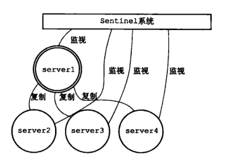
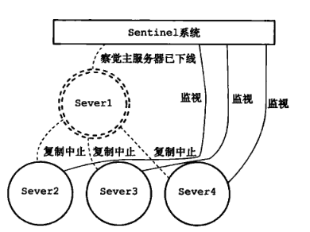
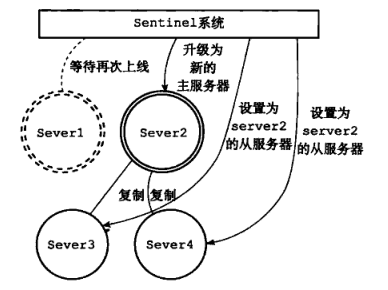

 # <p align="center">redis 高可用-哨兵模式</p>


- [1. Redis下载](#1)   
- [2. 管理工具下载](#2)   
- [3. 单机模式](#3)   
- [4. 端口号修改](#4)   
- [5. 设置密码](#5)   
- [6. 允许远程访问](#6)   
- [7. 高可用步骤一](#7)   
  - [7.1 启动master](#7.1)   
  - [7.2 配置slave](#7.2)   
  - [7.3 验证主从是否生效](#7.3)   
- [8. 高可用步骤二](#8)   
  - [8.1 配置哨兵](#8.1)   
  - [8.2 启动三个哨兵](#8.2)   
  - [8.3 哨兵大致的原理图](#8.3)   
- [9. 项目中redis配置修改](#9)   
- [10. 参考](#10)   


---

---

---


---
<h1 id="1">1. Redis下载</h1>

---

以windows环境为例，下载地址 https://github.com/MicrosoftArchive/redis/releases

**Assets**

* Redis-x64-3.2.100.msi
* Redis-x64-3.2.100.zip
* Source code(zip)
* Source code(tar.gz)

Zip的免安装版，下载解压即可，解压之后可以看到一个名为```redis-server.exe```的文件。


---
<h1 id="2">2. 管理工具下载</h1>

---

https://redisdesktop.com/download

该款工具名叫RedisDesktopManager。这里有windows、也有mac等，根据需要下载即可（需付费）。


---
<h1 id="3">3. 单机模式</h1>

---

如使用默认配置，直接双击```redis-server.exe```即可，如是linux环境的话，命令应该也是redis-server，默认端口是6379，默认是没有密码的，默认只能本机连接访问，因为默认是绑定了127.0.0.1。

以下章节将介绍，修改端口、密码、允许远程访问


---
<h1 id="4">4. 端口号修改</h1>

---

打开配置文件 **redis.windows.conf**，如下所示   
```
# Accept connections on the specified port, default is 6379 (IANA #815344).
# If port 0 is specified Redis will not listen on a TCP socket.
port 6379
```

默认端口号为6379，如果需要，可将6379改为你想要的端口号。

然后在 redis.windows.conf 同级目录下创建一个文件，如名为 **run6379.cmd**，内容如下   
```
redis-server redis.windows.conf
```
这个文件就是我们的新的启动脚本了。以后启动，直接双击这个启动脚本即可。启动时会显示出指定的端口号。


---
<h1 id="5">5. 设置密码改</h1>

---

一般开发环境我们很少设置密码，生产一般会设置密码，同样是 **redis.windows.conf** 文件，搜索requirepass找到   
```
########## SECURITY ###########
#
# requirepass foobared
```
这里是被注释掉的，例如我们改成下所示，那么密码就是aaaa
```
########## SECURITY ###########
requirepass aaaa
```
同样启动命名用：**redis-server redis.windows.conf**


---
<h1 id="6">6. 允许远程访问</h1>

---

同样是 **redis.windows.conf** 文件，搜索 bind 127.0.0.1，把这行注释掉，如下所示   
```
# IF YOU ARE SURE YOU WANT YOUR INSTANCE TO LISTEN TO ALL THE INTERFACES
# JUST COMMENT THE FOLLOWING LINE.
# ~~~~~~~~~~~~~~~~~~
# bind 127.0.0.1
```

同样启动命名用：**redis-server redis.windows.conf**


---
<h1 id="7">7. 高可用步骤一</h1>

---

**该步骤是启动多台redis服务，一主多从**


---
<h2 id="7.1">7.1 启动master</h2>

---

用启动命名 **redis-server redis.windows.conf** 启动一个redis实例，该实例比如端口是6379，那么这个实例就是我们的master了。


---
<h2 id="7.2">7.2 配置slave</h2>

---

1. **修改端口号**

复制一份 **redis.windows.conf**，比如重命名为 **redis.windows.conf-6479**，修改 redis.windows.conf-6479 里的端口号，改为6479。

2. **修改 slaveof**

找到   
```
# slaveof <masterip> <masterport>
```
添加以下内容（请注意空格）   
```
# slaveof <masterip> <masterport>
slaveof 127.0.0.1 6379
```

顾名思义，意思就是该6479实例，是主机127.0.0.1下6379实例的从属，改了**端口号、slaveof** 这两处配置之后，启动该从的实例即可。   
```
redis-server redis.windows.conf-6479
```


依照上述步骤，我们可以再复制 redis.windows.conf-6479，命名为 **redis.windows.conf-6579**，并修改redis.windows.conf-6579里的端口改为6579，并用启动命名redis-server redis.windows.conf-6579启动6579的实例，这样就成了一主多从的模式。


---
<h2 id="7.3">7.3 验证主从是否生效</h2>

---

用工具连接上这三个实例，比如我们在6379的主添加一个key，看下6479和6579两个从是否有同样的key生成，还有就是在6379的主删除一个key或者修改一个key，看两个从是否同步删除或更新。


---
<h1 id="8">8. 高可用步骤二</h1>

---

---
<h2 id="8.1">8.1 配置哨兵</h2>

---

新建文件

* sentinel.conf-26379
* sentinel.conf-26479
* sentinel.conf-26579

分别写入以下5行配置，注意端口号分别是26379、26479、26579别的一样   
```
port 26379
sentinel monitor mymaster 127.0.0.1 6379 2
sentinel down-after-milliseconds mymaster 60000
sentinel failover-timeout mymaster 180000
sentinel parallel-syncs mymaster 1
```

**配置说明：**
1. **port** ：当前Sentinel服务运行的端口
2. **sentinel monitor mymaster 127.0.0.1 6379 2**
Sentinel去监视一个名为mymaster的主redis实例，这个主实例的IP地址为本机地址127.0.0.1，端口号为6379，而将这个主实例判断为失效至少需要2个 Sentinel进程的同意，只要同意Sentinel的数量不达标，自动failover就不会执行
3. **sentinel down-after-milliseconds mymaster 60000**
指定了Sentinel认为Redis实例已经失效所需的毫秒数。当实例超过该时间没有返回PING，或者直接返回错误，那么Sentinel将这个实例标记为主观下线。只有一个 Sentinel进程将实例标记为主观下线并不一定会引起实例的自动故障迁移：只有在足够数量的Sentinel都将一个实例标记为主观下线之后，实例才会被标记为客观下线，这时自动故障迁移才会执行
4. **sentinel failover-timeout mymaster 180000** 
如果在该时间（ms）内未能完成failover操作，则认为该failover失败
5. **sentinel parallel-syncs mymaster 1**
指定了在执行故障转移时，最多可以有多少个从Redis实例在同步新的主实例，在从实例较多的情况下这个数字越小，同步的时间越长，完成故障转移所需的时间就越长


---
<h2 id="8.2">8.2 启动三个哨兵</h2>

---

命令是
```
redis-server sentinel.conf-26379 –sentinel
redis-server sentinel.conf-26479 –sentinel
redis-server sentinel.conf-26579 –sentinel
```

---
<h2 id="8.3">8.3 哨兵大致的原理图</h2>

---

   


<p align="center">在Server1 掉线后：</p>

   

<p align="center">升级Server2 为新的主服务器：</p>

   


意思大致就是主实例挂了之后，会将一个从实例提升为主实例，从而实现高可用。


---
<h1 id="9">9. 项目中redis配置修改</h1>

---

**默认单实例配置**，如下所示：

```
spring:
  redis:
    host: local.redis.com
    port: 6379
    password:
    timeout: 10s
    lettuce:
      pool:
        min-idle: 0
        max-idle: 8
        max-active: 8
        max-wait: -1ms
```

**哨兵模式配置**，如下所示：

```
  redis:
    sentinel:
      master: mymaster
      nodes: localhost:26379,localhost:26479,localhost:26579
    password:
    timeout: 10s
    lettuce:
      pool:
        min-idle: 0
        max-idle: 8
        max-active: 8
        max-wait: -1ms
```

其中 spring.redis.sentinel.master=mymaster 这个值mymaster是[第八章第1节](#8.1)配置哨兵的时候，那几行配置里起的名字。


---
<h1 id="10">10. 参考</h1>

---

http://bbs.redis.cn/forum.php?mod=viewthread&tid=715

http://redisdoc.com/topic/sentinel.html

https://www.cnblogs.com/LiZhiW/p/4851631.html

https://www.cnblogs.com/Eugene-Jin/p/10819601.html

本文基本是windows环境的讲解，linux基本套路也差不多，就是启动参数加配置文件。

建议：配置好了之后，尽量都做成启动脚本，直接启动脚本即可，这样更方便，脚本制作也很简单，参考[第四章](#4)，windows做成.cmd文件即可，linux做成.sh文件。


